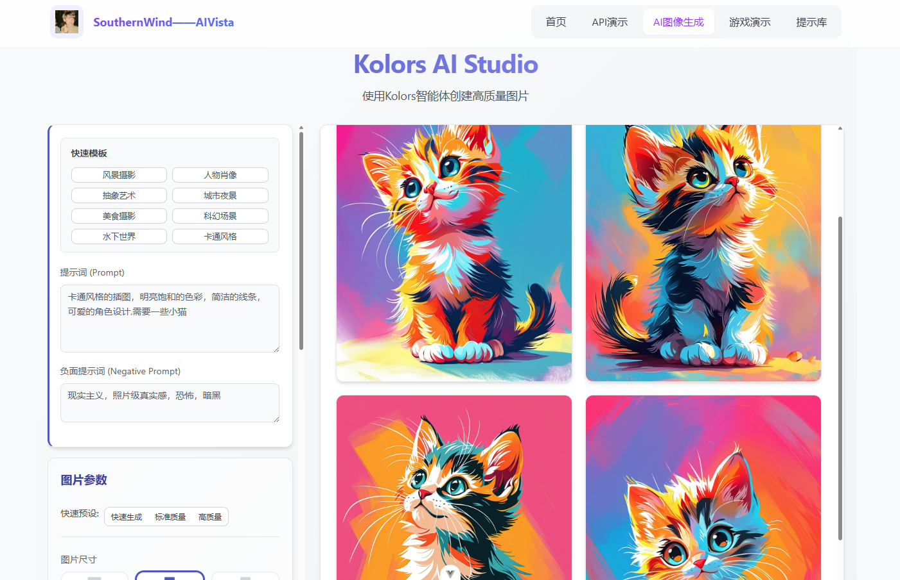
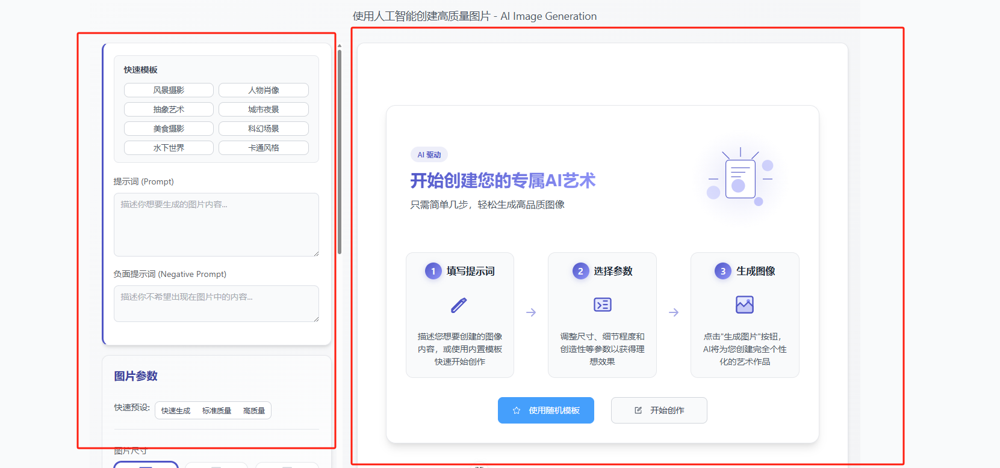

# AIVista Image Studio 是怎么做出来的：用 AI 画画的工具台背后的小故事
演示效果：





现在用人工智能（AI）画画变得越来越流行了，不再是科幻小说里的情节，而是我们身边就能玩起来的创意工具。不管是专业设计师还是普通爱好者，大家都想试试用 AI 把自己脑子里的想法变成漂亮的图片。

所以，我在网站`AIVista`集成了这个叫 **AIVista Image Studio** 的工具。它背后用了一个很厉害的 AI 模型（目前是 Kwai-Kolors/Kolors）来画画。这个工具不只是简单地调用一下 AI 接口，它更像一个在线画板，你能在这里调整各种设置、用现成的模板、上传参考图，还能管理生成的图片。

这篇“文章”会带你看看 AIVista Image Studio 是怎么一步步做出来的，从一开始的想法到最后的技术实现，还会分享一些关键的代码和我的想法。不管你是懂编程的，还是喜欢 AI 应用，或者只是对这类工具怎么做出来的感到好奇，都希望能给你带来点启发。

## ✨ 它能做些什么？（功能亮点）

AIVista Image Studio 努力让你用起来顺手、看得明白，同时功能还挺多：

1.  **告诉 AI 你想画啥**: 你可以用“提示词”（Prompt）告诉 AI 你想要画面的内容，也可以用“负面提示词”（Negative Prompt）告诉它你不想要什么东西出现。
2.  **快速开始**: 不知道怎么写提示词？没关系，我准备了各种风格的“快速模板”，点一下就能自动填好常用的描述和设置，让你马上就能开始玩。
3.  **调整各种设置**:
    *   **效果和速度选择**: 有“快速”、“标准”、“高质量”几种预设，方便你根据需要选择是快点出图还是效果更好。
    *   **图片形状**: 支持各种常见的图片比例，比如方的（1:1）、竖的（3:4、9:16）、横的（3:2、16:9）等等，点点图标就能选。
    *   **一次画几张**: 最多可以一次让 AI 画 4 张图，方便你挑一张最满意的。
    *   **创意 vs. 像不像**: 有个叫“引导系数”的滑块，拉动它可以控制 AI 画的图是更有创意、天马行空一些，还是更贴近你给的提示词。
    *   **画面细节**: 还有一个叫“推理步数”的滑块，可以控制画面的细节多少（最多 50 步，步数越多细节可能越多，但花的时间也越长）。
    *   **“运气”种子**: 你可以输入一个数字（叫“种子”，Seed）或者让系统随机给一个。用同一个种子，在其他设置不变的情况下，AI 就能画出差不多的图，方便你重复之前的效果或者探索类似的风格。
4.  **看着图画图**: 你可以上传一张自己的图片作为参考，AI 会努力画出和这张参考图风格相似的新图片。
5.  **看结果很方便**:
    *   AI 画好的图片会整齐地排列出来。
    *   你可以点开看大图、下载图片、复制这次用的“种子”数字，或者直接用这个种子再画一次。
6.  **用着舒服**:
    *   刚打开还没画图时，有个漂亮的引导页面告诉你怎么开始。
    *   点“生成图片”后，会告诉你 AI 正在努力画，还有个进度条和大概需要多少时间。
    *   整个界面设计得比较现代化，用了卡片式的布局，颜色和风格也比较统一。

## 🛠️ 搭积木（技术选型）

就像搭积木一样，也需要选好用的“零件”来搭建 AIVista Image Studio：

*   **技术选型**: Vue.js 3 - Element-Plus - TailwindCSS - Axios- Pinia 
*   **AI模型选择**: Kwai-Kolors/Kolors (通过 SiliconFlow API) - 这是目前我主要使用的 AI 模型，它很擅长根据描述生成高质量的图片。通过 SiliconFlow 提供的服务来使用它。

## 🚀 动手开干：搭建 AIVista Image Studio

下面我们深入“幕后”，看看 AIVista Image Studio 是怎么具体做出来的。

### 1. 代码放哪里？（项目结构）

核心代码主要放在两个文件里：

*   `src/components/AIImageGenerator.vue`: 这个文件负责你看到的所有界面元素、处理你的点击操作、记住你输入的设置等等。可以理解为“前台服务员”。
*   `src/services/imageService.ts`: 这个文件专门负责和 AI 服务器（那个真正画图的）打交道，把你的请求发过去，再把结果拿回来。可以理解为“后台通讯员”。

### 2. 界面长啥样？ (`AIImageGenerator.vue` - `<template>` 部分)

设计了一个左右两栏的布局：


*   **左侧 (`.form-container`)**: 这里放了所有让你填写的设置，比如提示词、图片大小、创意程度等等。我们用“卡片”把相关的设置分组放好，如果设置比较多，左边这块可以自己滚动。
*   **右侧 (`.results-container`)**: 这里是看结果的地方。如果 AI 正在画，这里会显示加载动画；如果画好了，就显示图片；如果还没开始画，就显示一个引导页面。如果图片很多，右边也可以滚动。

**用到的主要“界面零件” (来自 Element Plus)**:

*   **表单**: 用 `el-form` 和 `el-form-item` 来组织各种输入项。
*   **输入框**: `el-input` (包括能输入多行的 `type="textarea"`) 来让你写提示词。
*   **滑块**: `el-slider` 让你拖动来调整数字设置（比如画几张、创意程度、细节多少）。
*   **单选按钮**: `el-radio-group` 和 `el-radio-button` 用来选图片大小，我们还在按钮里加了小图标，更直观。
*   **上传按钮**: `el-upload` 让你能选择电脑里的图片上传作为参考图。我们还自己处理了上传逻辑 (`http-request`)。
*   **普通按钮**: `el-button` 用来触发各种操作，比如点“生成图片”、点“随机种子”、用模板、选预设、下载图片等等。
*   **弹窗**: `el-dialog` 用来在你点击图片时，弹出一个大图预览。

**选图片大小那块的代码大概长这样**:

```html
<!-- 图片尺寸选择 -->
<el-form-item label="图片尺寸">
  <!-- 这是按钮组 -->
  <el-radio-group v-model="formData.image_size" class="size-selector">
    <!-- 循环显示所有尺寸选项 -->
    <el-radio-button
      v-for="(value, key) in imageSizeOptions"
      :key="key"
      :value="value.value" /* 记录选中的是哪个尺寸值 */
      class="size-radio-button"
    >
      <!-- 按钮里面放的内容 -->
      <div class="size-option-content">
        <!-- 这个是代表比例的小图标 (SVG图形) -->
        <svg class="size-icon" ...>
          <rect ... /> <!-- 图标里的矩形，大小会根据比例变化 -->
        </svg>
        <!-- 显示比例文字，比如 "1:1" -->
        <span class="size-label">{{ value.ratioLabel || value.label }}</span>
      </div>
    </el-radio-button>
  </el-radio-group>
</el-form-item>
```


*(这段代码展示了如何用 Element Plus 的 Radio Button，并通过循环显示不同尺寸选项，每个选项包含一个动态变化的 SVG 图标和文字标签。)*

### 3. 程序怎么“记住”东西？ (`<script setup>` 部分)

用 Vue 3 的 `<script setup>`语法糖：

*   **你填写的设置 (`formData`)**:  `reactive` 里面存了所有要发给 AI 的设置，比如你写的提示词 (`prompt`)、不想要的提示词 (`negative_prompt`)、选的图片大小 (`image_size`)、画几张 (`batch_size`) 等等。
*   **界面当前的状态**: `ref` 来管理界面上的各种状态，比如 `loading` (是不是正在画图？), `imageUrl` (如果你上传了参考图，这里存着预览地址), `generatedImages` (存着 AI 画好的图片地址), `progress` (进度条到了百分之几), `estimatedTime` (估计还要多久), `previewVisible` (大图预览的弹窗是不是打开了) 等等。
*   **哪个预设被选中了**: 用 `selectedPresetLabel = ref(null)` 来记住用户当前选中的是哪个参数预设（比如“快速”、“标准”）。

```typescript
// 引入需要的功能
import { ref, reactive, watch, onMounted } from "vue";
import { ImageSize, type ImageGenerationResponse } from "../services/imageService";

// 用 reactive 存用户填的表单数据
const formData = reactive({
  prompt: "", // 提示词
  negative_prompt: "", // 不想要的提示词
  image_size: ImageSize.Square as ImageSize | string, // 图片大小，默认是方的
  batch_size: 1, // 一次画几张，默认1张
  num_inference_steps: 20, // 细节程度，默认20步
  guidance_scale: 7.5, // 创意程度，默认7.5
  seed: undefined as number | undefined, // “运气”种子，默认不设置（随机）
  image: undefined as string | undefined, // 上传的参考图数据 (Base64格式)
});

// 用 ref 存界面的状态
const loading = ref(false); // 是不是正在加载（画图）中？
const imageUrl = ref(""); // 参考图的预览地址
const generatedImages = ref<{ url: string }[]>([]); // 存放生成结果图片地址的列表
const lastSeed = ref<number | null>(null); // 上次画图用的种子是啥？
const generationTime = ref<number | null>(null); // 上次画图花了多少秒？

// 加载进度条相关的状态
const progress = ref(0); // 进度条百分比
const estimatedTime = ref(20); // 估计剩余时间（秒）
let progressTimer: number | null = null; // 用来控制进度条动画的计时器

// 图片预览弹窗相关的状态
const previewVisible = ref<boolean>(false); // 预览弹窗是不是显示？
const previewImage = ref<string>(""); // 预览弹窗里显示的图片地址
const previewTitle = ref<string>(""); // 预览弹窗的标题

// 哪个参数预设被选中了？
const selectedPresetLabel = ref<string | null>(null);
```
*(这段代码定义了程序需要跟踪的所有重要信息，包括用户的输入和界面的当前状态。)*

### 4. 用户操作怎么响应？（交互逻辑）

*   **滑块和输入框**: 很简单，直接用 `v-model` 把它们和你上面定义的 `formData` 里的对应项“绑”在一起，你一改输入框或滑块，程序就知道了。
*   **模板和预设**:
    *   点模板按钮 (`applyTemplate`): 把模板里写好的提示词和参数填到 `formData` 里，然后检查一下这些参数是不是刚好符合某个预设，是的话就把对应的预设按钮也点亮。
    *   选预设按钮 (`handlePresetChange` -> `applyPreset`): 把这个预设对应的参数（比如细节步数、创意程度）填到 `formData` 里，并且记住是哪个预设按钮被选中了 (`selectedPresetLabel`)。
    *   自动匹配预设 (`watch` 和 `onMounted`): 程序会“盯着”你调整的细节步数和创意程度。一旦你改了它们，或者页面刚加载时，它就会检查当前的参数组合是不是刚好和某个预设一模一样。如果一样，对应的预设按钮就会自动亮起来；如果你调的参数不属于任何一个预设，那所有预设按钮就都不会是选中状态。
*   **选图片大小**: 也是用 `v-model` 把按钮组和 `formData.image_size` 绑起来。还写了个 `getSvgRect` 函数，专门根据不同的比例（比如 1:1, 3:4）计算那个小图标里面矩形应该画多大、放在哪。
*   **随机种子**: 点“随机”按钮 (`randomizeSeed`) 就生成一个很大的随机数，填到 `formData.seed` 里。
*   **上传参考图**:
    *   你点上传按钮，选了图片后，`el-upload` 会调用我写的 `handleCustomUpload` 函数。
    *   这个函数拿到你选的图片文件。
    *   然后调用 `imageService.fileToBase64(file)` 把图片文件变成一长串文本（Base64格式）。
    *   这串文本会存到 `formData.image` 里，等下发给 AI；同时也会存到 `imageUrl` 里，这样你就能在界面上看到你上传图片的缩略图了。
    *   如果你想删掉上传的图片，点那个小叉号 (`removeImage`)，程序就会把存着的图片数据和预览地址都清空。

### 5. 最核心的：怎么让 AI 画图？ (`generateImage` 函数)

核心部分，当你点击“生成图片”按钮时，就会运行这个函数：

```typescript
// 这个函数是 async 的，表示里面有需要等待的操作（比如等 AI 画完）
const generateImage = async () => {
  // 0. 调试用：在控制台打印一下当前用户的所有设置
  console.log('准备发给 AI 的数据:', JSON.stringify(formData, null, 2));

  // 1. 先检查一下：是不是忘了填想画啥？
  if (!formData.prompt) {
    // 忘了填就提醒一下，然后不往下执行了
    ElMessage.warning("请先输入你想要画的内容（提示词）");
    return;
  }
  // (可选) 再检查一下：设置是不是超范围了？比如细节步数不能超过50
  if (formData.num_inference_steps > 50) {
      formData.num_inference_steps = 50; // 超过了就自动改成50
      ElMessage.warning("细节程度（推理步骤）最大只能是50，已自动调整");
  }

  // 2. 准备开始画了：
  loading.value = true; // 进入“加载中”状态
  generationTime.value = null; // 把上次的生成时间清掉
  generatedImages.value = []; // 把上次的结果图片清掉
  startProgressTimer(); // 让进度条开始动起来

  try { // 用 try...catch 包起来，这样如果中间出错能抓住
    const startTime = Date.now(); // 记一下开始时间
    // 3. 把用户的想法（formData）交给“后台通讯员”(imageService)去发给 AI 服务器
    const result = await imageService.generateImage({
      prompt: formData.prompt,
      negative_prompt: formData.negative_prompt || undefined, // 如果没填负面提示词，就不传
      image_size: formData.image_size,
      batch_size: formData.batch_size,
      num_inference_steps: formData.num_inference_steps,
      guidance_scale: formData.guidance_scale,
      seed: formData.seed,
      image: formData.image, // 把参考图数据也传过去
    });
    // 等 AI 服务器返回结果...
    const endTime = Date.now(); // 记一下结束时间

    // 4. 成功拿到结果了！
    generationTime.value = parseFloat(((endTime - startTime) / 1000).toFixed(1)); // 算一下花了多少秒
    generatedImages.value = result.images; // 把返回的图片地址存起来
    lastSeed.value = result.seed; // 把返回的种子存起来
    progress.value = 100; // 进度条直接拉满到100%
    ElMessage.success("图片生成成功！"); // 给个成功的提示

  } catch (error: any) { // 如果 try 里面任何一步出错了，就会跳到这里
    // 5. 处理出错情况
    progress.value = 0; // 进度条归零
    // （这里省略了复杂的错误分析，总之就是）给用户一个失败的提示
    ElMessage.error(`图片生成失败了: ${error.message || '未知错误'}`);
    console.error("图片生成失败详情:", error); // 在控制台打印详细错误，方便排查

  } finally { // 不管是成功还是失败，最后都要执行这里的代码
    // 6. 清理工作
    if (progressTimer !== null) {
      clearInterval(progressTimer); // 把进度条的计时器停掉
      progressTimer = null;
    }
    // 稍微等一下再结束加载状态，让用户能看到100%的进度条或者错误提示
    setTimeout(() => {
      loading.value = false; // 结束“加载中”状态
    }, 500); // 等半秒
  }
};

// 模拟进度条动的函数
const startProgressTimer = () => {
  progress.value = 0; // 进度条从0开始
  estimatedTime.value = 20; // 初始估计大概要20秒
  // 设置一个计时器，每隔一段时间（比如800毫秒）就更新一下进度
  progressTimer = window.setInterval(() => {
    // 只要进度没到99%，就随机加一点进度
    if (progress.value < 99) {
      const increment = Math.floor(Math.random() * 5) + 1; // 随机加1到5点进度
      progress.value = Math.min(99, progress.value + increment); // 更新进度，但最多只到99
      // 根据剩余进度重新估计时间
      const remainingProgress = 100 - progress.value;
      estimatedTime.value = Math.max(1, Math.round(remainingProgress / 5)); // 简单估计，至少1秒
    }
    // 注意：这里不再需要 else { clearInterval }，因为在 finally 里统一清除了
  }, 800);
};

// 当用户离开这个页面时，确保计时器被清掉
onUnmounted(() => {
  if (progressTimer !== null) {
    clearInterval(progressTimer);
  }
});
```

**简单来说，这个函数做了**:

*   **检查**: 看看用户是不是忘了填东西。
*   **通知**: 告诉用户“我开始画了”，并显示进度条。
*   **发送**: 把用户的要求发给 AI。
*   **接收**: 等待 AI 回复图片。
*   **显示**: 把图片展示给用户，或者告诉用户出错了。
*   **清理**: 结束加载状态。

### 6. 和 AI 服务器沟通的“小助手” (`imageService.ts`)

把和 AI 服务器打交道的代码单独放在一个文件里，有几个好处：让主界面代码更干净、更容易管理和修改和 AI 沟通的方式、以后如果想换个 AI 模型也更方便。

```typescript
import axios from 'axios'; // 引入那个专门发网络请求的工具
import { ElMessage } from 'element-plus'; // 引入 Element Plus 的提示框

// API 的配置信息 - **特别是密钥，应该来自环境变量，不能直接写代码里！**
const API_CONFIG = {
  baseURL: 'API', // AI 服务器的地址
  // !! 再次强调：密钥（API Key）像密码一样重要，千万别直接写在这里 !!
  // 应该像下面这样，尝试从一个叫“.env”的配置文件里读取
  // apiKey: import.meta.env.VITE_YOUR_API_KEY_ENV_VAR || 'sk-fallback-key' // 理想情况
  apiKey: import.meta.env.VITE_DEEPSEEK_API_KEY || 'sk-api-key' // 秘钥填写
};

// (这里省略了一些 TypeScript 的接口定义，它们是用来规定数据格式的)

// 定义一个“图片生成服务”类
class ImageGenerationService {
  // 类里面有一个核心方法，就是 generateImage
  async generateImage(params: ImageGenerationParams): Promise<ImageGenerationResponse> {
    // 1. 先检查一下“密钥”有没有配好 (非常重要！)
    if (!API_CONFIG.apiKey || API_CONFIG.apiKey === 'sk-...') {
        console.error('API Key 没配好或者用的是占位符！');
        // 如果没配好，就直接报错，不往下执行了
        throw new Error('API密钥没有正确配置，请检查设置');
    }

    // 2. 准备要发给 AI 服务器的数据包 (请求体)
    const requestBody: ImageGenerationRequest = {
      model: 'Kwai-Kolors/Kolors', // 告诉服务器用哪个 AI 模型
      prompt: params.prompt, // 用户想画什么
      image_size: params.image_size as string, // 图片大小
      batch_size: params.batch_size, // 画几张
      num_inference_steps: params.num_inference_steps, // 细节程度
      guidance_scale: params.guidance_scale, // 创意程度
      negative_prompt: params.negative_prompt || undefined, // 不想要什么（如果没有就不传）
      seed: params.seed, // 种子（如果没有就不传）
      image: params.image, // 参考图数据（Base64格式，如果没有就不传）
    };

    // 调试用：打印一下要发送的数据（但把密钥和图片数据隐藏掉）
    console.log('准备发送给 AI 的请求 (密钥已隐藏):', {
        ...requestBody,
        image: requestBody.image ? '[图片数据已隐藏]' : undefined
    });

    try { // 同样用 try...catch 包起来
      // 3. 用 axios 这个工具，把数据包发给 AI 服务器
      const response = await axios.post<ImageGenerationResponse>(
        `${API_CONFIG.baseURL}/images/generations`, // 发送到这个地址
        requestBody, // 发送的数据包
        {
          headers: { // 请求头，告诉服务器一些额外信息
            'Content-Type': 'application/json', // 数据是 JSON 格式
            'Authorization': `Bearer ${API_CONFIG.apiKey}` // **最重要的：用密钥进行身份认证**
          },
          timeout: 60000 // 设置一个超时时间，比如60秒，如果服务器太久没反应就报错
        }
      );
      // 等待服务器返回结果...
      console.log('收到 AI 服务器的回复:', response.data);
      // 把服务器返回的数据（里面应该有图片地址和种子）直接传回去
      return response.data;

    } catch (error: any) { // 如果发送或接收过程中出错了
      // 4. 处理错误
      console.error('和 AI 服务器通信出错了:', error.response?.data || error.message || error);
      // 尝试从错误信息里找出服务器返回的具体错误原因
      const backendError = error.response?.data?.error?.message || error.response?.data?.message;
      // 抛出一个包含具体原因（如果能找到的话）的错误
      throw new Error(backendError || '图片生成服务出错了，请稍后再试');
    }
  }

  // 一个辅助函数：把用户上传的图片文件转成 Base64 文本格式
  async fileToBase64(file: File): Promise<string> {
    // 这是 JavaScript 处理文件的标准方法
    return new Promise((resolve, reject) => {
      const reader = new FileReader();
      reader.readAsDataURL(file);
      reader.onload = () => resolve(reader.result as string); // 成功读完就返回 Base64 文本
      reader.onerror = error => reject(error); // 出错了就 báo cáo lỗi
    });
  }
}

// 创建这个服务的一个实例，并导出给其他文件使用
export const imageService = new ImageGenerationService();

```

**主要做了**:

*   **封装**: 把和 AI 服务器沟通的所有细节（比如服务器地址、用哪个模型、怎么认证、怎么处理错误）都包起来了。
*   **安全**: 特别强调了 API Key（密钥）的重要性，并演示了如何（应该）从环境变量读取，而不是写死在代码里。
*   **认证**: 在每次请求时都带上 API Key 去告诉服务器“我是合法的用户”。
*   **错误处理**: 统一处理和服务器沟通时可能发生的各种错误。
*   **工具**: 提供了一个把图片文件转成文本（Base64）的小工具。

### 7. 让界面更好看 (`<style scoped>` 部分)

美化界面：

*   **统一样式**: 先定义了一套“调色板”（颜色）、“阴影效果”、“圆角大小”、“各种间距”等等（用 CSS 变量），这样整个界面的风格就很统一。
*   **不影响别人 (`scoped`)**: 写的样式都加了 `scoped`，意思是这些样式只对当前这个 `AIImageGenerator.vue` 组件生效，不会跑到外面去影响页面的其他部分（如果有的话）。
*   **修改“现成零件”的样式 (`:deep()`)**: Element Plus 提供的零件虽然好用，但有时想微调一下它们的样子。这时就用 `:deep()` 这个“穿透”工具，去修改零件内部的样式（比如让滑块的颜色变成定义的主题色）。
*   **灵活布局**: 用了 Grid 和 Flexbox 这两种现代的布局方法，让界面元素能根据屏幕大小自动调整排列，在不同设备上看起来都不错。
*   **突出重点**: 通过不同的背景色、边框、阴影，让用户能更容易地区分不同的功能区域（比如提示词卡片、参数卡片）。
*   **细节是魔鬼**: 花时间调整了按钮按下去的效果、鼠标放上去的变化、输入框获得焦点时的样子等等这些小细节，让整体感觉更精致。

```css
/* 定义一些全局的“化妆品” (CSS 变量，部分示例) */
.image-gen-view {
  --zhuti-se: #4e54c8; /* 主题色 */
  --zhuti-liang: #8f94fb; /* 浅一点的主题色 */
  --beijing-qian: #f3f4f6; /* 很浅的背景灰 */
  --biankuang-se: #d1d5db; /* 边框颜色 */
  --yinying-zhong: 0 4px 6px -1px rgba(0, 0, 0, 0.1), 0 2px 4px -1px rgba(0, 0, 0, 0.06); /* 中等阴影 */
  --yuanjiao-da: 0.75rem; /* 大圆角 */
  --jianju-4: 1rem; /* 4号间距 */
  /* ... 还有很多其他的颜色、间距、字体大小等定义 ... */
}

/* 卡片的通用样式 */
.form-card {
  background: white; /* 白色背景 */
  border-radius: var(--yuanjiao-da); /* 用大圆角 */
  padding: var(--jianju-5); /* 内边距用5号间距 */
  box-shadow: var(--yinying-zhong); /* 加上中等阴影 */
  transition: transform 0.3s ease, box-shadow 0.3s ease; /* 鼠标放上去时有动画效果 */
  border: 1px solid var(--biankuang-se); /* 加个细边框 */
}

/* 深度修改 Element Plus 滑块的样子 */
/* 定位到第二个卡片里的滑块 */
.form-card:nth-of-type(2) :deep(.el-slider__runway) {
  background-color: var(--beijing-qian); /* 滑块的轨道用浅灰色 */
  height: 8px; /* 轨道粗细 */
  border-radius: 999px; /* 两头是圆的 */
}

/* 滑块上表示当前值的那个条 */
.form-card:nth-of-type(2) :deep(.el-slider__bar) {
  height: 8px; /* 和轨道一样粗 */
  /* 用渐变色填充 */
  background: linear-gradient(90deg, var(--zhuti-liang), var(--zhuti-se));
  border-radius: 999px; /* 两头也是圆的 */
}

/* ... 省略了大量其他的样式规则 ... */
```
*(这些 CSS 代码定义了整个工具的外观，从整体布局到按钮、滑块等小细节的样式。)*

## 回顾与未来（总结与展望）

总的来说，结合了 Vue 3、Element Plus和强大的 AI 画图技术，做出了这个叫 AIVista Image Studio 的在线工具。它不仅能让你细致地调整各种画图参数，还通过模板、预设、参考图这些功能，让你用起来更方便、更有趣。

在做的过程中，特别注意了：

*   **分工合作**: 把界面显示和跟 AI 沟通的代码分开写。
*   **记住状态**: 用 Vue 的方法来管理用户输入和界面状态。
*   **用户感觉**: 从引导页面到加载动画，再到按钮样式，都尽量做得好用、好看。
*   **安全第一**: 特别强调了像 API Key 这样的“密码”一定要保管好，不能直接写在代码里。

未来，AIVista Image Studio 还有很多可以改进和增加的功能：

*   **支持更多 AI**: 接入像 Stable Diffusion 这样其他流行的画图 AI。
*   **更多编辑功能**: 比如让 AI 修改图片的一部分（局部重绘），或者把图片往外扩展（扩图）。
*   **记住你的习惯**: 保存你常用的设置和画过的历史记录。
*   **分享作品**: 让你可以方便地把自己的 AI 画作和用的提示词分享给别人。

希望这篇文章能让你更好地了解 AIVista Image Studio 是怎么来的！如果你有什么想法或建议，欢迎告诉我。

