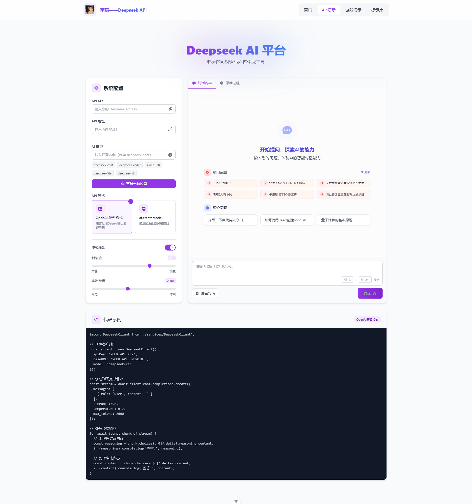
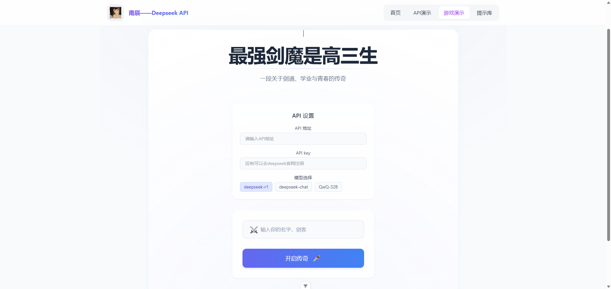
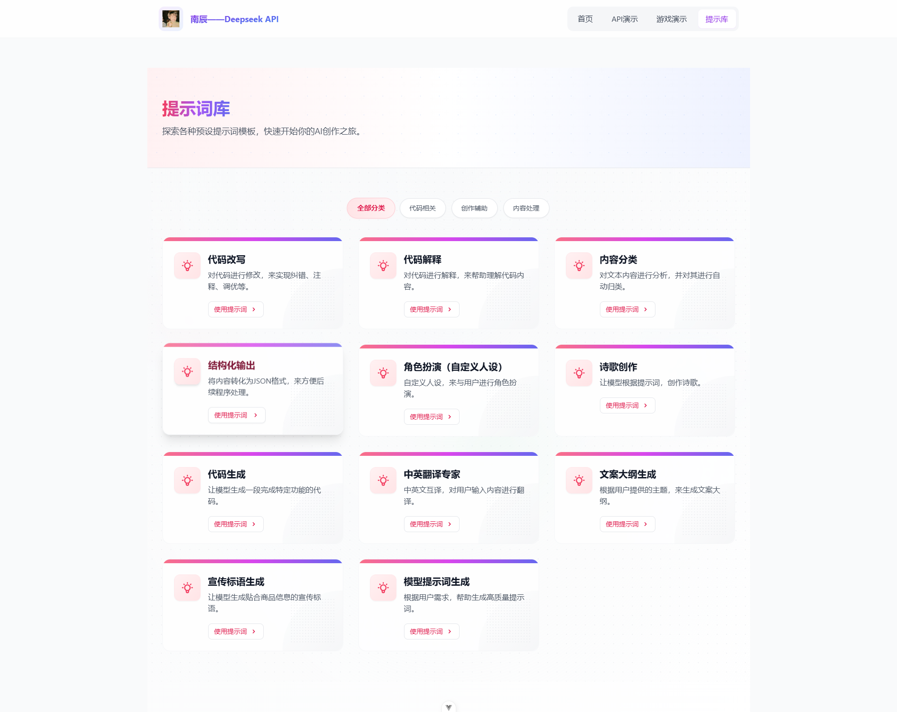

# 探索AI的无限可能，体验智能对话的未来，大模型 API 演示

先看效果：






## 项目概述

这是一个基于 Vue 3 + TypeScript + Vite 构建的 Deepseek API 演示项目，旨在提供一个简洁易用的界面来展示 Deepseek 大语言模型的能力。项目包含 API 演示和交互式游戏两个主要功能模块，同时支持两种不同风格的 API 调用方式。

## 📢 最新更新

- **2025.03.21**: 添加了文本生成终止功能，增强用户控制
  - 实现了在AI生成回答过程中随时终止生成的功能
  - 添加了明显的视觉标识，被手动终止的消息会显示"回答已被手动停止"
  - 使用AbortController API实现请求中断，确保资源释放
  - 优化了用户界面，在AI生成内容时显示"停止生成"按钮
  - 完善了相关API文档和使用说明

- **2025.03.20**: 修复了消息重复发送问题，优化了用户体验
  - 修复了消息重复发送的问题，确保每次点击发送按钮只会发送一次消息
  - 改进了示例问题功能，使其只设置输入内容而不自动发送，增强用户控制
  - 添加了防重复点击机制，避免用户多次点击导致的重复请求
  - 为输入框添加了ID标识，优化了DOM元素的可访问性
  - 优化了消息发送过程中的UI反馈，提供更好的视觉提示

- **2025.03.19**: 修复了消息重复发送问题，优化了API调用逻辑
  - 修复了每次发送消息时会重复发送数据的bug
  - 统一了消息管理机制，确保每条消息只被添加一次
  - 提高了API响应速度和资源利用率
  - 增强了用户界面的流畅度和稳定性

## 🚀 功能特性

- 🛑 终止生成：支持在AI生成回答过程中随时终止，保留已生成内容
- ✨ 流式输出：实时展示 AI 生成内容，提供更好的用户体验
- 🤔 思维链展示：查看模型的推理过程，深入了解模型如何思考
- 🔌 双风格 API：支持 OpenAI 兼容格式和 ai.createModel 风格的接口
- ⚙️ 完全可配置：支持调整各种参数，如温度、最大生成长度等
- 🎮 互动游戏：基于大语言模型的交互式游戏演示
- 🎨 精美 UI：基于 Tailwind CSS 构建的现代化 UI 界面

## 🏗 项目结构

```
vue-blog-demo/
├── public/             # 静态资源
├── src/
│   ├── assets/         # 项目资源文件
│   │   ├── DeepseekDemo.vue  # Deepseek API 演示组件
│   │   ├── GiaoGame.vue      # 交互式游戏组件
│   │   ├── HomePage.vue      # 主页组件
│   │   └── ...
│   ├── docs/           # 文档文件
│   ├── examples/       # 示例代码
│   ├── hooks/          # 自定义 Vue Hooks
│   ├── router/         # 路由配置
│   ├── services/       # 服务层
│   │   ├── DeepseekClient.ts   # OpenAI 风格客户端
│   │   ├── DeepseekAdapter.ts  # 适配器风格接口
│   │   └── ...
│   ├── stores/         # Pinia 状态管理
│   ├── views/          # 页面视图组件
│   │   ├── HomeView.vue       # 首页视图
│   │   ├── ApiDemoView.vue    # API 演示视图
│   │   └── GameView.vue       # 游戏演示视图
│   ├── App.vue         # 应用入口组件
│   └── main.ts         # 应用入口文件
├── index.html          # HTML 入口文件
├── vite.config.ts      # Vite 配置文件
├── tailwind.config.js  # Tailwind CSS 配置
└── ...
```

## 💡 技术亮点

### 1. 双重 API 设计模式

项目提供了两种风格的 API 调用方式，使开发者可以根据自己的喜好选择：

#### DeepseekClient：OpenAI 兼容格式

```typescript
import DeepseekClient from './services/DeepseekClient';

// 创建客户端
const client = new DeepseekClient({
  apiKey: 'your-api-key',
  baseURL: 'your-api-endpoint',
  model: 'deepseek-r1'
});

// 创建聊天完成请求
const stream = await client.chat.completions.create({
  messages: [
    { role: 'user', content: '请介绍一下李白' }
  ],
  stream: true
});

// 处理流式响应
for await (const chunk of stream) {
  // 处理思维链内容
  const reasoning = chunk.choices?.[0]?.delta?.reasoning_content;
  if (reasoning) console.log('思考:', reasoning);

  // 处理生成内容
  const content = chunk.choices?.[0]?.delta?.content;
  if (content) console.log('回答:', content);
}
```

#### DeepseekAdapter：ai.createModel 风格

```typescript
import ai from './services/DeepseekAdapter';

// 创建模型
const aiModel = ai.createModel("deepseek", {
  apiKey: 'your-api-key',
  baseURL: 'your-api-endpoint'
});

// 流式文本生成
const res = await aiModel.streamText({
  model: "deepseek-r1",
  messages: [
    { role: "user", content: "你好，请介绍一下李白" },
  ],
});

// 流式处理响应
for await (let data of res.dataStream) {
  // 打印思维链内容
  const think = data?.choices?.[0]?.delta?.reasoning_content;
  if (think) console.log('思维过程:', think);

  // 打印生成文本内容
  const text = data?.choices?.[0]?.delta?.content;
  if (text) console.log('生成内容:', text);
}
```

### 2. 精细的流式输出处理

项目实现了高效的流式输出处理机制，能够区分普通输出内容和思维链内容，并通过优雅的UI界面展示：

```typescript
// DeepseekClient.ts 中的流式处理示例
private processStreamPart(json: any): any {
  try {
    // 处理特殊字段，包括思维链
    if (json.choices && json.choices[0].delta) {
      const delta = json.choices[0].delta;
      
      // 识别并处理思维链内容
      if (delta.reasoning_content !== undefined) {
        // 这里是思维链内容的处理
        // ...
      }
      
      // 处理普通输出内容
      if (delta.content !== undefined) {
        // 这里是普通内容的处理
        // ...
      }
    }
    
    return json;
  } catch (e) {
    console.error('处理流部分时出错:', e);
    return json;
  }
}
```

### 3. 精美的 UI 动效实现

项目中的 UI 动效设计精良，特别是 HomePage 组件中的卡片悬停效果实现：

```html
<!-- 悬停动效示例 -->
<div @click="goToDemo" class="group cursor-pointer relative overflow-hidden">
  <div class="absolute inset-0 bg-gradient-to-r from-purple-500/20 to-blue-500/20 opacity-0 group-hover:opacity-100 transition-all duration-500 ease-out rounded-2xl"></div>
  <div class="relative bg-white p-8 rounded-2xl shadow-lg border border-gray-100 group-hover:translate-y-[-2px] group-hover:shadow-purple-100/50 group-hover:shadow-xl group-hover:border-purple-100 transition-all duration-500 ease-out">
    <div class="absolute top-0 left-0 w-full h-1 bg-gradient-to-r from-purple-500 to-blue-500 transform scale-x-0 group-hover:scale-x-100 transition-transform duration-500 ease-out"></div>
    <!-- 内容 -->
  </div>
</div>
```

这种实现使用了 Tailwind CSS 的 group 功能和复合动画，创建了多层次的视觉效果：
1. 背景渐变效果从透明渐变为可见
2. 卡片微妙上移并增加阴影
3. 顶部彩色条从左到右延展
4. 文字颜色平滑变换

### 4. 高级游戏逻辑实现

GiaoGame 组件中的游戏逻辑采用了基于大语言模型的状态管理，通过结构化游戏状态和 AI 响应解析实现复杂交互：

```typescript
// 游戏状态接口
interface GameState {
  player: {
    health: number;
    energy: number;
    inventory: string[];
    location: string;
  };
  environment: {
    description: string;
    availableActions: string[];
  };
  gameProgress: number;
  events: GameEvent[];
}

// 发送游戏指令到 AI
async function sendGameAction(action: string) {
  const response = await ai.generateText({
    model: modelName,
    messages: [
      { role: "system", content: gameSystemPrompt },
      { role: "user", content: `游戏状态: ${JSON.stringify(currentGameState)}\n玩家行动: ${action}` }
    ]
  });
  
  // 解析 AI 响应，更新游戏状态
  try {
    const jsonResponse = extractJsonFromResponse(response.choices[0].message.content);
    updateGameState(jsonResponse);
    renderGameInterface();
  } catch (error) {
    console.error("无法解析游戏响应", error);
    showErrorMessage("游戏响应格式错误，请重试");
  }
}
```

### 5. 终止生成功能实现

项目实现了灵活的终止生成功能，允许用户在AI输出过程中随时中断，提高了交互的自由度：

```typescript
// useDeepseekApi.ts 中的终止生成实现
const stopGeneration = () => {
  if (isProcessing.value) {
    // 停止处理
    isProcessing.value = false;

    // 标记最近的消息被停止
    isLastMessageStopped.value = true;

    // 如果有活跃的控制器，发送中止信号
    if (abortController.value) {
      abortController.value.abort();
      abortController.value = null;
    }

    // 重置进度
    streamProgress.value = 100;
    isThinking.value = false;
  }
};
```

终止生成功能的关键技术点：

1. **AbortController集成**：使用Web标准的AbortController API实现请求终止
2. **状态管理**：通过响应式变量跟踪消息状态，并在UI中反映
3. **优雅降级**：即使在中断后，也能保留已经生成的内容，提供部分回答
4. **资源优化**：及时释放网络连接和系统资源，提高性能
5. **用户体验**：提供明确的视觉反馈，让用户知道中断已成功执行

UI实现:

```html
<!-- 在DeepseekDemo.vue中的停止生成按钮 -->
<button 
  v-if="isProcessing" 
  @click="stopGeneration" 
  class="flex items-center justify-center px-4 py-2 bg-red-600 text-white rounded-lg hover:bg-red-700 transition-colors">
  <svg class="w-4 h-4 mr-1" fill="none" stroke="currentColor" viewBox="0 0 24 24">
    <path stroke-linecap="round" stroke-linejoin="round" stroke-width="2" d="M6 18L18 6M6 6l12 12"></path>
  </svg>
  停止生成
</button>

<!-- 已停止消息的标识 -->
<div v-if="isLastMessageStopped && index === messages.length - 1" 
     class="mt-2 text-sm font-medium text-amber-600 flex items-center">
  <svg class="w-4 h-4 mr-1" fill="none" stroke="currentColor" viewBox="0 0 24 24">
    <path stroke-linecap="round" stroke-linejoin="round" stroke-width="2" d="M12 9v2m0 4h.01m-6.938 4h13.856c1.54 0 2.502-1.667 1.732-3L13.732 4c-.77-1.333-2.694-1.333-3.464 0L3.34 16c-.77 1.333.192 3 1.732 3z"></path>
  </svg>
  回答已被手动停止
</div>
```

## 🛠 关键实现难点

### 1. 流式数据处理与渲染

流式数据处理是本项目的一个核心难点，特别是处理不规则的流数据分块：

```typescript
// 在 DeepseekClient.ts 中，流式数据处理的关键实现
async *processStream(response: Response): AsyncGenerator<any, void, unknown> {
  if (!response.body) {
    throw new Error("响应没有可读的正文");
  }

  const reader = response.body.getReader();
  const decoder = new TextDecoder();
  let buffer = '';

  try {
    while (true) {
      const { done, value } = await reader.read();
      if (done) break;
      
      buffer += decoder.decode(value, { stream: true });
      
      // 处理数据行
      const lines = buffer.split('\n');
      buffer = lines.pop() || '';
      
      for (const line of lines) {
        if (line.trim() === '') continue;
        if (line.trim() === 'data: [DONE]') continue;
        
        // 提取数据部分
        const message = line.replace(/^data: /, '');
        
        try {
          // 解析JSON数据
          const json = JSON.parse(message);
          yield this.processStreamPart(json);
        } catch (error) {
          console.error('解析流数据时出错:', error, 'Line:', line);
        }
      }
    }
  } catch (error) {
    console.error('读取流时出错:', error);
    throw error;
  } finally {
    reader.releaseLock();
  }
}
```

这个实现解决了流式数据的几个关键问题：
- 处理不完整的数据块和跨块的JSON
- 优雅地处理流结束标记
- 在解析错误时仍能继续处理后续数据
- 确保资源的正确释放

### 2. 响应式 UI 与状态管理

在 DeepseekDemo 组件中，需要处理多个异步状态流转，同时保持 UI 的响应性：

```typescript
// 响应式状态管理示例
const isLoading = ref(false);
const messageInput = ref('');
const messages = ref<MessageType[]>([]);
const reasoningContent = ref('');
const currentResponse = ref('');
const errorMsg = ref('');

// 发送消息处理
async function sendMessage() {
  if (!messageInput.value.trim() || isLoading.value) return;
  
  try {
    // 准备 UI 状态
    isLoading.value = true;
    errorMsg.value = '';
    const userMessage = messageInput.value;
    messageInput.value = '';
    
    // 添加用户消息
    messages.value.push({
      role: 'user',
      content: userMessage
    });
    
    // 准备 AI 响应占位
    reasoningContent.value = '';
    currentResponse.value = '';
    messages.value.push({
      role: 'assistant',
      content: '',
      reasoning: ''
    });
    
    // 发送请求并处理流式响应
    // ...流式处理代码...
    
  } catch (error) {
    errorMsg.value = `请求失败: ${error.message}`;
    console.error('请求失败:', error);
  } finally {
    isLoading.value = false;
  }
}
```

### 3. 渐进式 UI 显示效果

项目中的渐进式 UI 显示效果是一个值得注意的实现，特别是思维链和响应内容的分步展示：

```html
<!-- 思维链与响应内容的渐进式展示 -->
<div class="h-full overflow-y-auto p-4 space-y-4" ref="chatContainer">
  <template v-for="(message, index) in messages" :key="index">
    <!-- 用户消息 -->
    <div v-if="message.role === 'user'" class="flex justify-end mb-4">
      <div class="bg-purple-100 text-gray-800 rounded-lg py-2 px-4 max-w-[80%]">
        {{ message.content }}
      </div>
    </div>
    
    <!-- AI 响应 -->
    <div v-else class="space-y-2">
      <!-- 思维链内容（如果有） -->
      <div v-if="message.reasoning" class="bg-gray-50 border border-gray-100 rounded-lg p-4 text-sm text-gray-700">
        <div class="flex items-center mb-2">
          <div class="w-4 h-4 bg-purple-100 rounded-full flex items-center justify-center mr-2">
            <span class="text-purple-600 text-xs">🤔</span>
          </div>
          <span class="text-gray-500 text-xs font-medium">思维过程</span>
        </div>
        <div class="prose prose-sm max-w-none" v-html="formatMarkdown(message.reasoning)"></div>
      </div>
      
      <!-- AI 回答内容 -->
      <div class="bg-blue-50 border border-blue-100 rounded-lg py-2 px-4 text-gray-800 max-w-[80%]">
        <div class="prose prose-sm max-w-none" v-html="formatMarkdown(message.content || '思考中...')"></div>
      </div>
    </div>
  </template>
</div>
```

## 🎮 游戏实现的实现步骤与关键技术

本项目的游戏部分是一个基于大语言模型的互动式剧情游戏，通过为AI提供丰富的上下文来生成引人入胜的故事内容。下面是实现此功能的关键步骤：

### 1. 游戏设计与核心思想

游戏"最强剑魔是高三生"讲述了一名高三学生在学业、游戏与社交间平衡的故事。设计上融合了以下关键点：

- **角色设定**：主角作为高三学生兼游戏主播的双重身份
- **三维度属性**：游戏技能、学习能力、社交关系三个维度的平衡发展
- **分支剧情**：玩家的选择导致故事走向不同路径
- **事件触发器**：特殊事件的随机触发增加游戏的可玩性

### 2. 与AI大模型的交互流程

游戏的核心是与AI模型的交互，具体流程如下：

1. **准备上下文信息**：
   ```typescript
   // 准备发送给AI的上下文信息
   const context = {
     // 角色背景
     characterBackground: `姓名：${playerName}（游戏ID：最强剑魔）
        身份：高三学生，知名游戏主播
        游戏特长：英雄联盟剑魔玩家，连续29天冲击王者失败
        性格特点：游戏时激情四射，现实中是个普通学生...`,
     
     // 当前场景
     currentScene: {
       id: currentSceneId,
       description: '高考倒计时30天，教室里...',
       playerChoice: choiceText,
       mood: '焦虑',
       location: '教室'
     },
     
     // 故事进度
     progress: {
       gaming: 25, // 游戏技能点
       study: 10,  // 学习能力点
       social: 5    // 社交关系点
     },
     
     // 历史选择记录（提供连续性）
     history: previousChoices
   };
   ```

2. **构建游戏提示词**：将上下文信息转换为结构化的提示词

   ```typescript
   const prompt = `
   你是一个游戏剧情生成器，请基于以下信息生成下一个场景：
   
   ${JSON.stringify(context)}
   
   请生成:
   1. 场景描述（200字以内）
   2. 主角内心独白或对话（50字以内）
   3. 3个选项，每个选项需包含：
      - 选项文本
      - 选项提示（可选）
      - 选项的影响（gaming/study/social属性的变化）
   4. 如果合适，提供一个特殊事件
   
   请以JSON格式返回，包含这些字段：description, dialog, options, specialEvent
   `;
   ```

3. **处理流式响应**：

   ```typescript
   // 发送流式请求
   const response = await sendStreamRequest(messages, {
     onReasoningUpdate: (chunk) => {
       // 实时更新思维链，让玩家看到AI的思考过程
       gameStore.updateReasoningStream(chunk);
     },
     onDialogUpdate: (chunk) => {
       // 实时更新对话内容
       gameStore.updateDialogStream(chunk);
     }
   });
   ```

### 3. 关键流式输出实现

在游戏场景中实时显示AI的思维过程和生成内容是一个重要功能，实现方式如下：

```typescript
// 处理流式响应
async function sendStreamRequest(messages, callbacks) {
  const response = await fetch(API_URL, {
    method: 'POST',
    headers: { ... },
    body: JSON.stringify({
      model: 'deepseek-r1',
      messages: messages,
      stream: true
    })
  });

  const reader = response.body.getReader();
  let buffer = '';
  
  while (true) {
    const { done, value } = await reader.read();
    if (done) break;
    
    buffer += new TextDecoder().decode(value);
    const lines = buffer.split('\n');
    buffer = lines.pop() || '';
    
    for (const line of lines) {
      if (!line.startsWith('data:')) continue;
      
      try {
        const json = JSON.parse(line.substring(5));
        
        // 提取思维链内容
        if (json.choices[0].delta.reasoning_content) {
          callbacks.onReasoningUpdate(json.choices[0].delta.reasoning_content);
        }
        
        // 提取正常输出内容
        if (json.choices[0].delta.content) {
          callbacks.onDialogUpdate(json.choices[0].delta.content);
        }
      } catch (e) { 
        console.error('处理流式数据出错:', e);
      }
    }
  }
}
```

### 4. 游戏状态管理与存档

游戏的状态管理和存档功能是实现连续游戏体验的关键：

```typescript
// 游戏状态接口
interface GameState {
  playerName: string;
  currentSceneId: number;
  currentScene?: GameScene;
  storyProgress: {
    mainQuests: {
      gaming: number;  // 0-100
      study: number;   // 0-100
      social: number;  // 0-100
    };
    relationships: Record<string, {
      character: string;
      affinity: number;  // -100到100
      events: string[];
    }>;
    flags: Set<string>;  // 解锁的故事标记
  };
  gameLogs: Array<{
    sceneId: number;
    choiceText: string;
    timestamp: string;
  }>;
}
```

### 5. 提供给AI的关键词与指令

为了让AI生成高质量的游戏内容，以下关键词和技巧非常重要：

- **人物语言风格指导**：提供主角的经典台词集合，让AI模仿风格
  ```
  经典台词:
  - "回答我！我Q会不会空？" （游戏台词）
  - "这把打完我得了MVP！" （游戏台词）
  - "怎么不找找自己的问题？" （生活感悟）
  - "你很不稳重" （对他人评价风格）
  ```

- **场景类型指导**：提供可能的场景类型列表
  ```
  场景类型: ['课堂学习', '游戏训练', '排位赛', '直播现场', '考试现场', '社交互动'...]
  ```

- **特殊事件触发机制**：提供可能的特殊事件列表
  ```
  特殊事件: ['炸麦警告（情绪激动导致麦克风爆音）', '躺赢时刻（队友carry）'...]
  ```

- **关系变量追踪**：告诉AI要跟踪不同角色之间的关系变化
  ```
  关系追踪: {'李雪': {affinity: 10, events: ['一起双排']}, '王老师': {affinity: -5, events: ['上课玩手机被抓']}}
  ```

### 6. UI中的实时显示优化

游戏UI中的实时显示效果通过以下技术实现：

```html
<!-- 思维过程展示 (仅当使用deepseek-r1时显示) -->
<div v-if="reasoningContent && modelName === 'deepseek-r1'" 
     class="relative overflow-hidden bg-purple-50 rounded-2xl p-6 border border-purple-100 animate-fadeIn">
  <div class="flex gap-4">
    <div class="text-2xl shrink-0">🤔</div>
    <div>
      <h3 class="font-bold text-slate-800 mb-2 flex items-center gap-2">
        <span>思维过程</span>
        <span v-if="isThinking" class="inline-flex items-center px-2 py-1 rounded-full bg-purple-100 text-purple-700 text-xs font-medium">
          思考中
          <span class="ml-1 flex space-x-1">
            <span class="w-1 h-1 bg-purple-700 rounded-full animate-bounce" style="animation-delay: 0s"></span>
            <span class="w-1 h-1 bg-purple-700 rounded-full animate-bounce" style="animation-delay: 0.1s"></span>
            <span class="w-1 h-1 bg-purple-700 rounded-full animate-bounce" style="animation-delay: 0.2s"></span>
          </span>
        </span>
      </h3>
      <div class="text-slate-600 prose prose-sm max-w-none">
        <p>{{ reasoningContent }}</p>
      </div>
    </div>
  </div>
</div>

<!-- 对话框，带流式输出效果 -->
<div class="bg-slate-50 rounded-2xl p-6 border border-slate-100">
  <div class="flex gap-4">
    <div class="text-2xl shrink-0">💭</div>
    <p class="text-slate-600 italic">{{ currentDialogStream || currentScene.dialog }}</p>
  </div>
</div>
```

## 📦 快速开始

### 安装依赖

```bash
npm install
# 或
yarn
# 或
pnpm install
```

### 开发模式

```bash
npm run dev
# 或
yarn dev
# 或
pnpm dev
```

### 构建生产版本

```bash
npm run build
# 或
yarn build
# 或
pnpm build
```

### 预览生产版本

```bash
npm run preview
# 或
yarn preview
# 或
pnpm preview
```

## 🔧 配置项目

1. 在 `.env` 文件中配置默认 API 端点和其他环境变量（可选）
2. 调整 `vite.config.ts` 以适配部署环境

## 📋 常见问题

### 如何停止正在进行的AI生成？

在AI正在生成回答时，发送按钮会变成"停止生成"按钮（红色）。点击该按钮可以立即终止生成过程，系统会保留已生成的部分内容，并在消息下方显示"回答已被手动停止"的标识。这个功能在以下情况特别有用：

- 当AI生成的内容过长，且您已经得到了需要的信息时
- 当生成的回答偏离了您的预期，想要重新提问时
- 当您想在某个特定点停止生成，保留已有部分而不需要等待完整回答时

### 使用API时需要注意什么？

## 🤝 贡献

欢迎贡献代码、提交 Issues 或 Pull Requests。请确保遵循项目的代码风格并添加适当的测试。

## 📄 许可证

MIT

## 用户体验优化

### 聊天界面体验优化

- **实时响应显示**：聊天消息发送后立即在对话内容区域显示，不再需要等待思考过程完成
- **流畅滚动效果**：新增平滑滚动，确保用户始终能看到最新生成的内容
- **多重滚动保障**：通过多层次滚动机制，解决长文本和复杂格式内容显示问题
- **内容实时更新**：AI回答生成时，内容区域实时更新并自动滚动至最新位置
- **标签页自动切换**：优化消息流转换逻辑，提供更加连贯的用户体验
- **AI思考状态展示**：在对话气泡中直接显示AI思考状态，包含动画效果和提示信息
- **双层思考提示**：同时在页面顶部和最新AI消息中显示思考状态，提供清晰的视觉反馈

### Deepseek模型支持

- **流式输出支持**：完整支持Deepseek模型的流式响应功能
- **思维链展示**：通过思维标签页查看AI的推理过程
- **多模型支持**：支持多种deepseek模型，包括deepseek-chat、deepseek-coder等
- **API风格选择**：支持OpenAI兼容格式和自定义适配器两种调用风格
