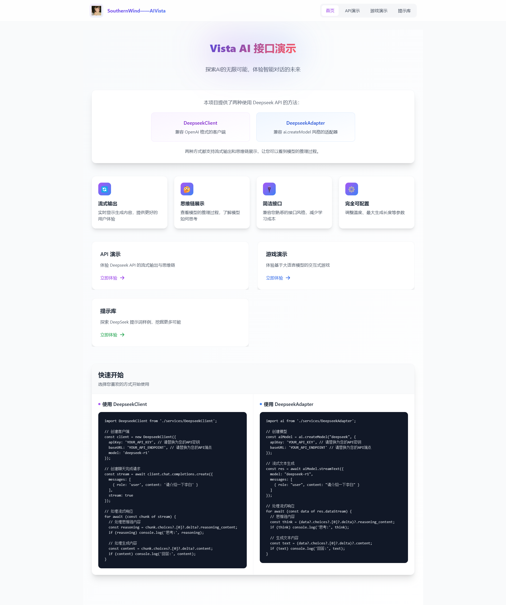
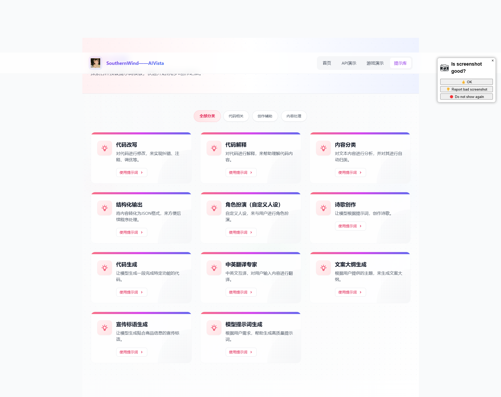

# 探索AI的无限可能，体验智能对话的未来，大模型 API 演示

先看效果：




## 项目概述

这是一个基于 Vue 3 + TypeScript + Vite 构建的 Vista AI 演示项目，旨在提供一个简洁易用的界面来展示 Vista AI 大语言模型的能力。项目包含 API 演示和交互式游戏两个主要功能模块，同时支持两种不同风格的 API 调用方式。

## 📢 最新更新

- **2025.03.25**: 游戏UI全面升级，添加游戏结束机制
  - 实现了游戏进度达到100%时的结束机制，展示成就消息
  - 全新设计的场景描述和对话内容卡片，采用渐变背景和动态效果
  - 优化了游戏界面的视觉层次和用户体验
  - 添加了响应式UI元素，确保在各种设备上都有良好表现
  - 完善了文档说明，便于开发者进行二次开发

- **2025.03.23**: 优化自动滚动机制，提升聊天体验
  - 实现了智能自动滚动机制，新消息到达时自动滚动至底部
  - 当用户手动滚动查看历史消息时，暂停自动滚动功能
  - 当用户滚动回底部后，自动恢复滚动功能
  - 添加平滑滚动效果，优化视觉体验
  - 修复了在某些情况下滚动失效的问题

- **2025.03.21**: 添加了文本生成终止功能，增强用户控制
  - 实现了在AI生成回答过程中随时终止生成的功能
  - 添加了明显的视觉标识，被手动终止的消息会显示"回答已被手动停止"
  - 使用AbortController API实现请求中断，确保资源释放
  - 优化了用户界面，在AI生成内容时显示"停止生成"按钮
  - 完善了相关API文档和使用说明

- **2025.03.20**: 修复了消息重复发送问题，优化了用户体验
  - 修复了消息重复发送的问题，确保每次点击发送按钮只会发送一次消息
  - 改进了示例问题功能，使其只设置输入内容而不自动发送，增强用户控制
  - 添加了防重复点击机制，避免用户多次点击导致的重复请求
  - 为输入框添加了ID标识，优化了DOM元素的可访问性
  - 优化了消息发送过程中的UI反馈，提供更好的视觉提示

- **2025.03.19**: 修复了消息重复发送问题，优化了API调用逻辑
  - 修复了每次发送消息时会重复发送数据的bug
  - 统一了消息管理机制，确保每条消息只被添加一次
  - 提高了API响应速度和资源利用率
  - 增强了用户界面的流畅度和稳定性

## 🚀 功能特性

- 🛑 终止生成：支持在AI生成回答过程中随时终止，保留已生成内容
- ✨ 流式输出：实时展示 AI 生成内容，提供更好的用户体验
- 🤔 思维链展示：查看模型的推理过程，深入了解模型如何思考
- 🔌 双风格 API：支持 OpenAI 兼容格式和 ai.createModel 风格的接口
- ⚙️ 完全可配置：支持调整各种参数，如温度、最大生成长度等
- 🎮 互动游戏：基于大语言模型的交互式游戏演示
- 🎨 精美 UI：基于 Tailwind CSS 构建的现代化 UI 界面
- 📱 智能滚动：优化的自动滚动机制，提供更自然的对话体验
- 🏆 游戏目标：多维进度系统，任一指标达到100%时触发游戏结束

## 🏗 项目结构

```
vue-blog-demo/
├── public/             # 静态资源
├── src/
│   ├── assets/         # 项目资源文件
│   │   ├── DeepseekDemo.vue  # Deepseek API 演示组件
│   │   ├── GiaoGame.vue      # 交互式游戏组件
│   │   ├── HomePage.vue      # 主页组件
│   │   └── ...
│   ├── docs/           # 文档文件
│   ├── examples/       # 示例代码
│   ├── hooks/          # 自定义 Vue Hooks
│   ├── router/         # 路由配置
│   ├── services/       # 服务层
│   │   ├── DeepseekClient.ts   # OpenAI 风格客户端
│   │   ├── DeepseekAdapter.ts  # 适配器风格接口
│   │   └── ...
│   ├── stores/         # Pinia 状态管理
│   ├── views/          # 页面视图组件
│   │   ├── HomeView.vue       # 首页视图
│   │   ├── ApiDemoView.vue    # API 演示视图
│   │   └── GameView.vue       # 游戏演示视图
│   ├── App.vue         # 应用入口组件
│   └── main.ts         # 应用入口文件
├── index.html          # HTML 入口文件
├── vite.config.ts      # Vite 配置文件
├── tailwind.config.js  # Tailwind CSS 配置
└── ...
```

## 💡 技术亮点

### 1. 双重 API 设计模式

项目提供了两种风格的 API 调用方式，使开发者可以根据自己的喜好选择：

#### DeepseekClient：OpenAI 兼容格式

```typescript
import DeepseekClient from './services/DeepseekClient';

// 创建客户端
const client = new DeepseekClient({
  apiKey: 'your-api-key',
  baseURL: 'your-api-endpoint',
  model: 'deepseek-r1'
});

// 创建聊天完成请求
const stream = await client.chat.completions.create({
  messages: [
    { role: 'user', content: '请介绍一下李白' }
  ],
  stream: true
});

// 处理流式响应
for await (const chunk of stream) {
  // 处理思维链内容
  const reasoning = chunk.choices?.[0]?.delta?.reasoning_content;
  if (reasoning) console.log('思考:', reasoning);

  // 处理生成内容
  const content = chunk.choices?.[0]?.delta?.content;
  if (content) console.log('回答:', content);
}
```

#### DeepseekAdapter：ai.createModel 风格

```typescript
import ai from './services/DeepseekAdapter';

// 创建模型
const aiModel = ai.createModel("deepseek", {
  apiKey: 'your-api-key',
  baseURL: 'your-api-endpoint'
});

// 流式文本生成
const res = await aiModel.streamText({
  model: "deepseek-r1",
  messages: [
    { role: "user", content: "你好，请介绍一下李白" },
  ],
});

// 流式处理响应
for await (let data of res.dataStream) {
  // 打印思维链内容
  const think = data?.choices?.[0]?.delta?.reasoning_content;
  if (think) console.log('思维过程:', think);

  // 打印生成文本内容
  const text = data?.choices?.[0]?.delta?.content;
  if (text) console.log('生成内容:', text);
}
```

### 2. 精细的流式输出处理

项目实现了高效的流式输出处理机制，能够区分普通输出内容和思维链内容，并通过优雅的UI界面展示：

```typescript
// DeepseekClient.ts 中的流式处理示例
private processStreamPart(json: any): any {
  try {
    // 处理特殊字段，包括思维链
    if (json.choices && json.choices[0].delta) {
      const delta = json.choices[0].delta;
      
      // 识别并处理思维链内容
      if (delta.reasoning_content !== undefined) {
        // 这里是思维链内容的处理
        // ...
      }
      
      // 处理普通输出内容
      if (delta.content !== undefined) {
        // 这里是普通内容的处理
        // ...
      }
    }
    
    return json;
  } catch (e) {
    console.error('处理流部分时出错:', e);
    return json;
  }
}
```

### 3. 精美的 UI 动效实现

项目中的 UI 动效设计精良，特别是 HomePage 组件中的卡片悬停效果实现：

```html
<!-- 悬停动效示例 -->
<div @click="goToDemo" class="group cursor-pointer relative overflow-hidden">
  <div class="absolute inset-0 bg-gradient-to-r from-purple-500/20 to-blue-500/20 opacity-0 group-hover:opacity-100 transition-all duration-500 ease-out rounded-2xl"></div>
  <div class="relative bg-white p-8 rounded-2xl shadow-lg border border-gray-100 group-hover:translate-y-[-2px] group-hover:shadow-purple-100/50 group-hover:shadow-xl group-hover:border-purple-100 transition-all duration-500 ease-out">
    <div class="absolute top-0 left-0 w-full h-1 bg-gradient-to-r from-purple-500 to-blue-500 transform scale-x-0 group-hover:scale-x-100 transition-transform duration-500 ease-out"></div>
    <!-- 内容 -->
  </div>
</div>
```

这种实现使用了 Tailwind CSS 的 group 功能和复合动画，创建了多层次的视觉效果：
1. 背景渐变效果从透明渐变为可见
2. 卡片微妙上移并增加阴影
3. 顶部彩色条从左到右延展
4. 文字颜色平滑变换

### 4. 高级游戏逻辑实现

GiaoGame 组件中的游戏逻辑采用了基于大语言模型的状态管理，通过结构化游戏状态和 AI 响应解析实现复杂交互：

```typescript
// 游戏状态接口
interface GameState {
  player: {
    health: number;
    energy: number;
    inventory: string[];
    location: string;
  };
  environment: {
    description: string;
    availableActions: string[];
  };
  gameProgress: number;
  events: GameEvent[];
}

// 发送游戏指令到 AI
async function sendGameAction(action: string) {
  const response = await ai.generateText({
    model: modelName,
    messages: [
      { role: "system", content: gameSystemPrompt },
      { role: "user", content: `游戏状态: ${JSON.stringify(currentGameState)}\n玩家行动: ${action}` }
    ]
  });
  
  // 解析 AI 响应，更新游戏状态
  try {
    const jsonResponse = extractJsonFromResponse(response.choices[0].message.content);
    updateGameState(jsonResponse);
    renderGameInterface();
  } catch (error) {
    console.error("无法解析游戏响应", error);
    showErrorMessage("游戏响应格式错误，请重试");
  }
}
```

### 5. 终止生成功能实现

项目实现了灵活的终止生成功能，允许用户在AI输出过程中随时中断，提高了交互的自由度：

```typescript
// useDeepseekApi.ts 中的终止生成实现
const stopGeneration = () => {
  if (isProcessing.value) {
    isProcessing.value = false;
    isLastMessageStopped.value = true; // 标记消息被手动终止
    
    if (abortController.value) {
      abortController.value.abort(); // 中断网络请求
      abortController.value = null;
    }
    
    streamProgress.value = 100;
    isThinking.value = false;
  }
};

// 在DeepseekClient.ts中集成AbortController
async chatCompletion(params: {
  messages: Array<{role: string; content: string}>;
  stream?: boolean;
  signal?: AbortSignal; // 添加终止信号
}): Promise<any> {
  const { messages, stream = false, signal } = params;
  
  // 构建请求参数
  const requestBody = {
    model: this.model,
    messages,
    temperature: this.temperature,
    max_tokens: this.maxTokens,
    stream
  };
  
  // 发送请求，传递终止信号
  const response = await fetch(`${this.baseURL}`, {
    method: 'POST',
    headers: {
      'Content-Type': 'application/json',
      'Authorization': `Bearer ${this.apiKey}`
    },
    body: JSON.stringify(requestBody),
    signal // 传递AbortSignal
  });
  
  // 处理响应...
}
```

### 6. 智能滚动机制

项目实现了智能自动滚动机制，提供更自然的对话体验：

```typescript
// 滚动处理函数
const handleScroll = () => {
  if (!chatContainer.value) return;
  
  const container = chatContainer.value;
  const isNearBottom = container.scrollHeight - container.scrollTop - container.clientHeight < 100;
  
  // 只有当用户滚动到接近底部时才启用自动滚动
  shouldAutoScroll.value = isNearBottom;
  
  // 清除现有定时器并设置新的定时器
  if (scrollTimer) {
    clearTimeout(scrollTimer);
  }
  
  // 短暂延迟后检查滚动状态
  scrollTimer = setTimeout(() => {
    const isStillNearBottom = container.scrollHeight - container.scrollTop - container.clientHeight < 100;
    shouldAutoScroll.value = isStillNearBottom;
  }, 150);
};

// 防抖处理的滚动到底部函数
const debouncedScrollToBottom = debounce((forceScroll = false) => {
  const container = chatContainer.value;
  if (!container) return;
  
  // 如果强制滚动或者应该自动滚动，则执行滚动
  if (forceScroll || shouldAutoScroll.value || isProcessing.value) {
    container.style.scrollBehavior = 'smooth';
    container.scrollTop = container.scrollHeight;
  }
}, 100);
```

### 7. 游戏结束系统

游戏结束系统实现了多维进度管理和成就展示：

```typescript
// 游戏结束状态管理
const showGameOver = ref(false);
const gameOverTitle = ref('');
const gameOverMessage = ref('');
const gameOverType = ref('');

// 检查游戏进度是否达到结束条件
const checkGameProgress = () => {
  const { gaming, study, social } = progress.value.mainQuests;
  
  if (gaming >= 100) {
    showGameOver.value = true;
    gameOverTitle.value = '游戏达人';
    gameOverMessage.value = '我爸玩游戏得了MVP';
    gameOverType.value = 'gaming';
    return true;
  }
  
  if (study >= 100) {
    showGameOver.value = true;
    gameOverTitle.value = '学霸养成';
    gameOverMessage.value = '成功考入清北，前途无量';
    gameOverType.value = 'study';
    return true;
  }
  
  if (social >= 100) {
    showGameOver.value = true;
    gameOverTitle.value = '社交达人';
    gameOverMessage.value = '成为校园红人，人气爆棚';
    gameOverType.value = 'social';
    return true;
  }
  
  return false;
};

// 在处理选项影响时调用
const processImpact = (impact) => {
  if (impact.quest) {
    const { type, value } = impact.quest;
    progress.value.mainQuests[type] = Math.min(100, progress.value.mainQuests[type] + value);
  }
  
  if (impact.relationship) {
    // 处理关系变化
  }
  
  // 检查游戏是否结束
  checkGameProgress();
};
```

## 🔧 快速开始

### 安装依赖

```bash
pnpm install
```

### 开发模式

```bash
pnpm dev

```

### 构建生产版本

```bash
pnpm run build
```

## 📚 文档

详细的API文档和游戏开发指南可以在 `docs` 目录下找到：

- `API使用说明.md`: Deepseek API 的完整使用文档
- `game-guide.md`: 交互式游戏开发指南

## 用户体验优化

### 聊天界面体验优化

- **实时响应显示**：聊天消息发送后立即在对话内容区域显示，不再需要等待思考过程完成
- **流畅滚动效果**：新增平滑滚动，确保用户始终能看到最新生成的内容
- **多重滚动保障**：通过多层次滚动机制，解决长文本和复杂格式内容显示问题
- **内容实时更新**：AI回答生成时，内容区域实时更新并自动滚动至最新位置
- **标签页自动切换**：优化消息流转换逻辑，提供更加连贯的用户体验
- **AI思考状态展示**：在对话气泡中直接显示AI思考状态，包含动画效果和提示信息
- **双层思考提示**：同时在页面顶部和最新AI消息中显示思考状态，提供清晰的视觉反馈

### Deepseek模型支持

- **流式输出支持**：完整支持Deepseek模型的流式响应功能
- **思维链展示**：通过思维标签页查看AI的推理过程
- **多模型支持**：支持多种deepseek模型，包括deepseek-chat、deepseek-coder等
- **API风格选择**：支持OpenAI兼容格式和自定义适配器两种调用风格
