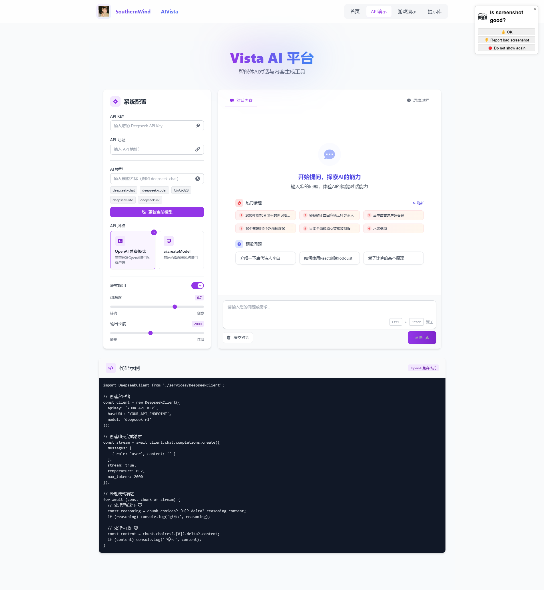
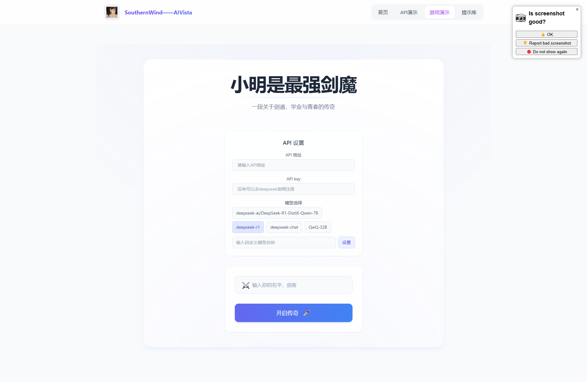

# AI Vista - 探索AI的无限可能，体验智能对话的未来

<p align="center">
  
</p>
<p align="center">
  
  
</p>

## 项目概述

AI Vista 是一个基于 **Vue 3 + TypeScript + Vite** 构建的下一代 AI 演示平台，集成多种大模型接口，提供企业级的流式响应、思维链展示与多模态创作体验。项目包含智能对话、AI 图像生成、交互式游戏、无限流小说等多个功能模块。

## 📢 最新更新

### 2025.12 - 重大更新

- **🎨 首页全面重构**：采用全新 Bento Grid 布局设计
  - 高级光影美学与极光背景效果
  - 三大核心价值展示卡片（认知推理、视觉创造、无限流互动）
  - 流体交错的功能卡片矩阵
  - 丰富的微交互动画（blob、scan、fadeInUp 等）
  - 底部数据统计面板（50ms 延迟、128k 上下文、99.9% SLA）

- **🚂 新增「第13号列车」无限流交互小说**
  - 沉浸式视觉小说体验
  - 多分支剧情与多结局系统
  - 记忆碎片收集机制
  - 循环计数与进度追踪
  - 打字机效果对话展示
  - 人物立绘与场景切换
  - 科幻风格 HUD 界面

- **🤖 MCP 智能体功能上线**
  - 数据神经链路连接
  - 智能体对话管理

### 历史更新

- **2025.03.25**: 游戏UI全面升级，添加游戏结束机制
- **2025.03.23**: 优化自动滚动机制，提升聊天体验
- **2025.03.21**: 添加文本生成终止功能，增强用户控制
- **2025.03.20**: 修复消息重复发送问题，优化用户体验

## 🚀 功能特性

### 核心能力

| 功能 | 描述 |
|------|------|
| 🧠 **智能对话** | 集成 Deepseek-R1 核心，支持思维链 (CoT) 深度推理 |
| 🎨 **AI 图像生成** | 文本到图像，4K 级艺术画作生成 |
| 🎮 **交互式游戏** | 基于 LLM 的 Roguelike 游戏引擎 |
| 📖 **无限流小说** | 「第13号列车」多分支交互式叙事体验 |
| 📚 **提示词库** | 结构化 Prompt 模板管理 |
| 🤖 **MCP 智能体** | 数据神经链路智能体系统 |

### 技术特性

- ✨ **流式输出**：实时展示 AI 生成内容
- 🤔 **思维链展示**：查看模型的推理过程
- 🔌 **双风格 API**：支持 OpenAI 兼容格式和 ai.createModel 风格
- ⚙️ **完全可配置**：支持调整温度、最大生成长度等参数
- 🛑 **终止生成**：支持随时中断 AI 输出
- 📱 **智能滚动**：优化的自动滚动机制
- 🎨 **精美 UI**：基于 Tailwind CSS 的现代化界面

## 🏗 项目结构

```
magicforge/
├── public/                 # 静态资源
├── src/
│   ├── assets/            # 项目资源文件
│   ├── components/        # 通用组件
│   │   ├── HomePage.vue       # 首页组件 (Bento Grid 布局)
│   │   ├── GiaoGame.vue       # 交互式游戏组件
│   │   ├── DeepseekDemo.vue   # Deepseek API 演示
│   │   └── ...
│   ├── views/             # 页面视图
│   │   ├── HomeView.vue       # 首页视图
│   │   ├── ApiDemoView.vue    # API 演示视图
│   │   ├── GameView.vue       # 游戏演示视图
│   │   ├── ScenarioView.vue   # 第13号列车 (无限流小说)
│   │   ├── McpAgentView.vue   # MCP 智能体视图
│   │   ├── AIImageView.vue    # AI 图像生成视图
│   │   └── PromptLibraryView.vue  # 提示词库视图
│   ├── services/          # 服务层
│   │   ├── DeepseekClient.ts  # OpenAI 风格客户端
│   │   ├── DeepseekAdapter.ts # 适配器风格接口
│   │   └── ...
│   ├── stores/            # Pinia 状态管理
│   ├── router/            # 路由配置
│   ├── hooks/             # 自定义 Vue Hooks
│   └── docs/              # 文档文件
├── docs/                  # 项目文档
└── ...
```

## 🎮 功能模块详解

### 1. 智能对话引擎

集成 Deepseek-R1 核心，提供深度逻辑分析与复杂问题拆解能力：

```typescript
import DeepseekClient from './services/DeepseekClient';

const client = new DeepseekClient({
  apiKey: 'your-api-key',
  baseURL: 'your-api-endpoint',
  model: 'deepseek-r1'
});

const stream = await client.chat.completions.create({
  messages: [{ role: 'user', content: '请介绍一下李白' }],
  stream: true
});

for await (const chunk of stream) {
  const reasoning = chunk.choices?.[0]?.delta?.reasoning_content;
  const content = chunk.choices?.[0]?.delta?.content;
  if (reasoning) console.log('思考:', reasoning);
  if (content) console.log('回答:', content);
}
```

### 2. 第13号列车 - 无限流交互小说

全新的沉浸式视觉小说体验，融合 Roguelike 元素：

**核心特性：**
- 🔄 **循环机制**：死亡后重新开始，保留记忆碎片
- 🧩 **碎片收集**：解锁隐藏剧情与选项
- 🎭 **多结局系统**：好结局与坏结局分支
- 💬 **打字机效果**：沉浸式对话展示
- 🖼️ **动态立绘**：角色表情与场景切换
- 🎯 **HUD 界面**：循环计数、场景追踪

**剧情设定：**
> 你在一列神秘的 K-13 次列车上醒来，广播宣布终点站是"地狱"，倒计时 15 分钟。通过收集记忆碎片、做出关键选择，揭开列车的真相...

### 3. 交互式游戏 (Sword Legend)

基于大语言模型的状态管理游戏：

- 多维进度系统（游戏、学习、社交）
- AI 驱动的动态剧情生成
- 关系系统与事件追踪
- 游戏结束成就展示

### 4. 首页 Bento Grid 布局

采用现代化的 Bento Grid 设计语言：

**设计亮点：**
- 极光背景动效与磨砂玻璃质感
- 三大核心价值卡片展示
- 流体交错的功能矩阵
- 悬浮光影与微交互动画
- 响应式布局适配

**技术实现：**
```html
<!-- Bento Grid 布局示例 -->
<div class="grid grid-cols-1 md:grid-cols-2 lg:grid-cols-4 gap-6 auto-rows-[240px]">
  <!-- 核心卡片：2x2 -->
  <div class="col-span-1 md:col-span-2 row-span-2">...</div>
  <!-- 工具卡片：1x1 -->
  <div class="col-span-1">...</div>
  <!-- 游戏卡片：2x1 -->
  <div class="col-span-1 md:col-span-2">...</div>
</div>
```

## 💡 技术亮点

### 双重 API 设计模式

项目提供两种风格的 API 调用方式：

**DeepseekClient (OpenAI 兼容格式)**
```typescript
const client = new DeepseekClient({ apiKey, baseURL, model });
const stream = await client.chat.completions.create({ messages, stream: true });
```

**DeepseekAdapter (ai.createModel 风格)**
```typescript
const model = ai.createModel("deepseek", { apiKey, baseURL });
const { dataStream } = await model.streamText({ model: "deepseek-r1", messages });
```

### 高级动画系统

```css
/* 极光背景动效 */
@keyframes blob {
  0% { transform: translate(0px, 0px) scale(1); }
  33% { transform: translate(30px, -50px) scale(1.1); }
  66% { transform: translate(-20px, 20px) scale(0.9); }
  100% { transform: translate(0px, 0px) scale(1); }
}

/* 扫描线效果 */
@keyframes scan {
  0% { transform: translateY(-100%); }
  100% { transform: translateY(500%); }
}
```

### 智能滚动机制

```typescript
const handleScroll = () => {
  const isNearBottom = container.scrollHeight - container.scrollTop - container.clientHeight < 100;
  shouldAutoScroll.value = isNearBottom;
};
```

## 🔧 快速开始

### 环境要求

- Node.js >= 18
- pnpm >= 8

### 安装依赖

```bash
pnpm install
```

### 配置环境变量

```bash
cp .env.example .env
# 编辑 .env 文件，填入你的 API Key
```

### 开发模式

```bash
pnpm dev
```

### 构建生产版本

```bash
pnpm build
```

### 预览生产版本

```bash
pnpm preview
```

## 📚 文档

详细文档位于 `docs` 目录：

| 文档 | 描述 |
|------|------|
| [API使用说明.md](docs/API使用说明.md) | Deepseek API 完整使用文档 |
| [game-guide.md](docs/game-guide.md) | 交互式游戏开发指南 |
| [prompt-optimization-guide.md](docs/prompt-optimization-guide.md) | 提示词优化指南 |
| [MCP智能体页面说明.md](docs/MCP智能体页面说明.md) | MCP 智能体使用说明 |

## 🛣️ 路由结构

| 路径 | 页面 | 描述 |
|------|------|------|
| `/` | 首页 | Bento Grid 布局展示 |
| `/api-demo` | API 演示 | 智能对话演示 |
| `/ai-image` | AI 图像 | 文本生成图像 |
| `/game` | 游戏 | Sword Legend 交互游戏 |
| `/scenario` | 第13号列车 | 无限流交互小说 |
| `/prompt-library` | 提示词库 | Prompt 模板管理 |
| `/mcp-agent` | MCP 智能体 | 智能体对话 |

## 🎯 性能指标

| 指标 | 数值 |
|------|------|
| 响应延迟 | ~50ms |
| 上下文窗口 | 128k tokens |
| 场景数量 | ∞ (无限生成) |
| 服务可用性 | 99.9% SLA |

## 🤝 贡献指南

欢迎提交 Issue 和 Pull Request！

## 📄 许可证

MIT License

---

<p align="center">
  <strong>© 2025 AI Vista Platform. Design for Future.</strong>
</p>
