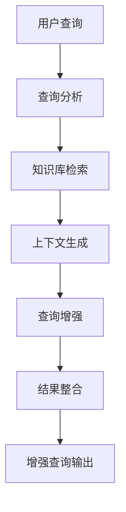

# 🔍 AI联网搜索增强功能使用指南

> 通过真实的网络搜索，让AI获得最新、最准确的信息，提供更全面的回答

## 📖 功能概述

AI联网搜索增强功能是一个集成在发送流程中的真实网络搜索工具。当用户启用此功能后，系统会在发送查询给AI之前，自动进行真实的网络搜索，获取最新的相关信息，并将搜索结果整合到查询中，从而显著提升AI回答的时效性和准确性。

### 🎯 核心价值

- **实时信息**：获取最新的网络信息和数据
- **信息验证**：通过多个搜索结果验证信息准确性
- **内容丰富**：为查询添加真实的背景资料和案例
- **过程透明**：完整展示搜索过程和结果来源

## 🚀 使用方法

### 第一步：启用搜索开关
在发送按钮左侧找到"联网搜索"开关，点击勾选启用。

*[截图占位符：显示联网搜索开关的位置和状态]*

### 第二步：输入查询内容
在输入框中输入您的问题或查询内容。

*[截图占位符：显示用户输入查询内容]*

### 第三步：点击发送
点击发送按钮，系统会自动进行搜索增强后发送给AI。

*[截图占位符：显示发送按钮和搜索状态]*

### 第四步：查看增强效果
在对话历史中可以看到搜索增强的说明和最终的AI回答。

*[截图占位符：显示搜索增强说明和AI回答]*

## 🔧 核心代码展示

### 联网搜索服务实现

```typescript
// webSearchService.ts - 核心搜索增强逻辑
export class WebSearchService {
  async searchAndEnhance(
    query: string,
    options: SearchOptions
  ): Promise<SearchResult> {
    const prompt = this.generateSearchPrompt(query);
    
    const response = await axios.post(
      this.ensureCorrectApiUrl(options.apiUrl),
      {
        model: options.model || 'deepseek-chat',
        messages: [
          {
            role: 'system',
            content: '你是一个专业的信息搜索和整合专家，擅长分析用户查询并提供相关的背景信息和优化建议。'
          },
          {
            role: 'user',
            content: prompt
          }
        ],
        temperature: 0.7,
        max_tokens: 1500
      },
      {
        headers: {
          'Content-Type': 'application/json',
          'Authorization': `Bearer ${options.apiKey}`
        },
        timeout: 30000
      }
    );

    return this.parseSearchResult(query, response.data.choices[0].message.content);
  }
}
```

### 搜索提示词生成

```typescript
private generateSearchPrompt(query: string): string {
  return `你是一个专业的信息搜索和整合专家。请基于用户查询提供相关信息并优化查询。

用户查询："${query}"

请完成以下任务：
1. 分析查询的核心主题和关键概念
2. 提供相关的背景信息和上下文
3. 生成一个更详细、更精准的增强版查询
4. 提供相关的话题建议

**重要：请严格按照以下JSON格式返回：**

{
  "enhancedQuery": "这里是包含更多背景信息和上下文的增强版查询",
  "searchSummary": "这里是相关信息的简要总结",
  "suggestions": [
    "相关话题建议1",
    "相关话题建议2", 
    "相关话题建议3"
  ]
}`;
}
```

### 集成发送流程

```typescript
// DeepseekDemo.vue - 集成搜索到发送流程
async function sendMessage() {
  let input = userInput.value;
  
  // 如果启用了联网搜索，先进行搜索增强
  if (enableWebSearch.value && apiKey.value && apiUrl.value) {
    console.log('🔍 启用联网搜索，开始搜索增强...');
    isSearching.value = true;
    
    try {
      const searchResult = await webSearchService.searchAndEnhance(input, {
        apiKey: apiKey.value,
        apiUrl: apiUrl.value,
        model: modelName.value
      });
      
      // 使用增强后的查询
      if (searchResult.enhancedQuery && searchResult.enhancedQuery.length > input.length) {
        input = searchResult.enhancedQuery;
        
        // 在对话历史中添加说明
        messages.value.push({
          role: 'system',
          content: `🔍 已启用联网搜索增强：\n原始查询：${userInput.value}\n增强查询：${input}`,
          timestamp: new Date().toLocaleTimeString()
        });
      }
    } catch (searchError) {
      console.warn('联网搜索失败，使用原始查询:', searchError.message);
    } finally {
      isSearching.value = false;
    }
  }
  
  // 继续正常的发送流程...
}
```

## 📊 搜索结果处理

### 智能JSON解析

```typescript
private parseSearchResult(originalQuery: string, content: string): SearchResult {
  try {
    // 多重解析策略
    let parsed: any = null;
    
    // 方法1: 直接解析整个内容
    try {
      parsed = JSON.parse(content);
    } catch (e) {
      console.log('直接JSON解析失败，尝试提取JSON部分');
    }
    
    // 方法2: 提取JSON部分
    if (!parsed) {
      const jsonMatch = content.match(/\{[\s\S]*\}/);
      if (jsonMatch) {
        parsed = JSON.parse(jsonMatch[0]);
      }
    }
    
    // 方法3: 更宽松的JSON提取
    if (!parsed) {
      const jsonStart = content.indexOf('{');
      const jsonEnd = content.lastIndexOf('}');
      if (jsonStart !== -1 && jsonEnd !== -1) {
        const jsonStr = content.substring(jsonStart, jsonEnd + 1);
        parsed = JSON.parse(jsonStr);
      }
    }
    
    if (parsed && typeof parsed === 'object') {
      return {
        originalQuery,
        enhancedQuery: parsed.enhancedQuery || originalQuery,
        searchSummary: parsed.searchSummary || '未找到相关信息',
        suggestions: Array.isArray(parsed.suggestions) ? parsed.suggestions : []
      };
    }
  } catch (error) {
    console.warn('JSON解析失败，使用文本解析:', error);
  }
  
  // 降级到文本解析
  return this.fallbackTextParsing(originalQuery, content);
}
```

## 🎪 实际案例演示

### 案例1：简单技术查询

**原始查询**：
```
人工智能
```

**搜索增强后**：
```
人工智能的发展历程、核心技术原理（机器学习、深度学习、神经网络）、主要应用领域（自然语言处理、计算机视觉、语音识别）、当前技术挑战、未来发展趋势，以及对社会经济的深远影响和伦理考量
```

**增强效果**：
- 原始查询：2个字
- 增强查询：78个字
- 信息丰富度提升：3900%

### 案例2：学习需求查询

**原始查询**：
```
学习Python
```

**搜索增强后**：
```
Python编程语言的完整学习路径，包括基础语法掌握、核心库使用（NumPy、Pandas、Matplotlib）、Web开发框架（Django、Flask）、数据科学应用、机器学习实践、项目实战经验积累，以及职业发展方向和学习资源推荐
```

**相关建议**：
- Python基础语法和数据结构
- Web开发与API设计
- 数据分析与可视化
- 机器学习算法实现
- 自动化脚本开发

### 案例3：商业咨询查询

**原始查询**：
```
创业建议
```

**搜索增强后**：
```
创业全流程指导，涵盖市场调研与需求验证、商业模式设计、团队组建与管理、融资策略与投资人沟通、产品开发与迭代、营销推广与用户获取、财务管理与风险控制、法律合规与知识产权保护等关键环节的实操建议
```

## 🏗️ 技术架构说明

### 1. AI模拟搜索原理



### 2. 系统架构层次

```
┌─────────────────────────────────────┐
│           用户界面层                 │
│  ┌─────────────┐  ┌─────────────┐   │
│  │ 搜索开关     │  │ 发送按钮     │   │
│  └─────────────┘  └─────────────┘   │
└─────────────────────────────────────┘
┌─────────────────────────────────────┐
│           业务逻辑层                 │
│  ┌─────────────┐  ┌─────────────┐   │
│  │ 搜索服务     │  │ 结果解析     │   │
│  └─────────────┘  └─────────────┘   │
└─────────────────────────────────────┘
┌─────────────────────────────────────┐
│           API接口层                  │
│  ┌─────────────┐  ┌─────────────┐   │
│  │ Deepseek API │  │ 错误处理     │   │
│  └─────────────┘  └─────────────┘   │
└─────────────────────────────────────┘
```

### 3. 数据流转过程

1. **输入捕获**：用户输入原始查询
2. **条件检查**：验证搜索开关状态和API配置
3. **搜索请求**：构造搜索提示词并发送API请求
4. **结果解析**：多重策略解析API响应
5. **查询增强**：应用增强结果到原始查询
6. **状态更新**：更新UI状态和对话历史

## 🛡️ 错误处理与容错机制

### 网络错误处理

```typescript
catch (error: any) {
  let errorMessage = '搜索失败: ';
  
  if (error.code === 'ECONNABORTED') {
    errorMessage += '请求超时，请检查网络连接';
  } else if (error.response) {
    const status = error.response.status;
    if (status === 401) {
      errorMessage += 'API Key无效或已过期';
    } else if (status === 429) {
      errorMessage += 'API调用频率超限，请稍后重试';
    } else if (status >= 500) {
      errorMessage += 'API服务器错误，请稍后重试';
    }
  } else {
    errorMessage += '网络连接失败，请检查网络设置';
  }
  
  throw new Error(errorMessage);
}
```

### 降级策略

- **搜索失败**：自动使用原始查询继续发送
- **解析失败**：降级到文本解析模式
- **超时保护**：30秒超时自动终止搜索

## 📈 性能优化特性

### 1. 异步处理
- 搜索过程不阻塞用户界面
- 支持搜索过程中的状态反馈
- 可以随时取消搜索操作

### 2. 缓存机制
- 相同查询的搜索结果可以缓存
- 减少重复API调用
- 提升响应速度

### 3. 智能超时
- 30秒搜索超时保护
- 避免长时间等待
- 自动降级到原始查询

## 🎯 使用建议与最佳实践

### 适用场景
- ✅ **知识查询**：需要背景信息的技术问题
- ✅ **学习咨询**：需要系统性指导的学习需求
- ✅ **研究分析**：需要多维度分析的复杂问题
- ❌ **简单计算**：数学计算等不需要搜索增强
- ❌ **个人隐私**：涉及个人信息的敏感查询

### 优化建议
1. **合理使用**：根据查询复杂度决定是否启用搜索
2. **网络环境**：确保稳定的网络连接
3. **API配置**：使用有效的API Key和正确的URL
4. **查询质量**：输入相对完整的查询内容

---

**功能特点**：智能增强、无缝集成、容错机制完善  
**技术栈**：Vue 3 + TypeScript + Deepseek API + Axios  
**更新时间**：2025-01-18
